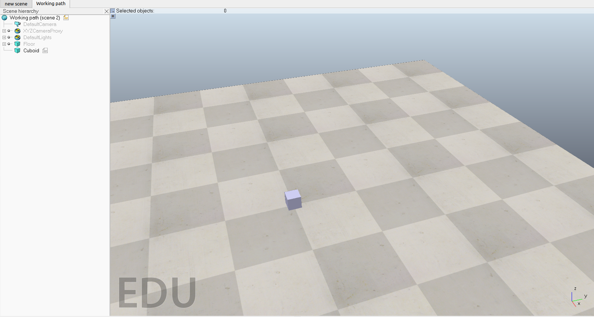
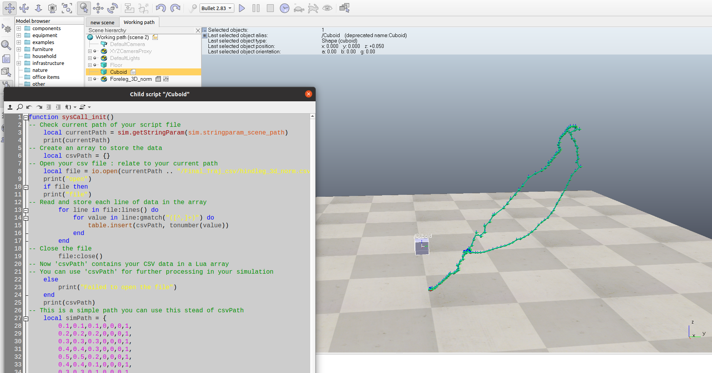

# Upload CSV file to CoppeliaSim (VREP)

## Introduction
In this tutorial, it will be shown how to upload a CSV file to CoppeliaSim (VREP).
A script will be used to read the CSV file and create a trajectory for the robot/object that you intend to move.

## Prerequisites
- [CoppeliaSim](https://www.coppeliarobotics.com/downloads) (VREP) installed.
- CSV file with the trajectory to be followed.
- CoppeliaSim scene with the robot/object that will follow the trajectory.

## Step 1: Create a CSV file with the trajectory to be followed
The CSV file must have the following format:
| x  | y  | z  | qx | qy | qz | qw |
|----|----|----|----|----|----|----|
|    |    |    |    |    |    |    |
|    |    |    |    |    |    |    |

This is the only format that CoppeliaSim accept for the paths. 
The first row must contain the names of the columns, and the following rows must contain the values of the trajectory. By using third part programs like excel or google sheets, you can create the CSV file and save it in .csv format.

## Step 2: CoppeliaSim scene


In CoppeliaSim scene you will need to add a dummy object. This object will be the one that will follow the trajectory. (it can be any kind of object, even a primitive shape like cuboids)
After adding the dummy object, you will need to add this script by right clicking on the dummy object and selecting `Add` -> `Associated child script` -> `Non-threaded`.
Then, you will need to copy this script to the dummy object script.
```lua
function sysCall_init()
-- Check current path of your script file
    local currentPath = sim.getStringParam(sim.stringparam_scene_path)
    print(currentPath)
-- Create an array to store the data
    local csvPath = {}
-- Open your csv file : relate to your current path
    local file = io.open(currentPath .. "/path&to&your&file.csv", "r")
    print("open")
    if file then
    print("file")
-- Read and store each line of data in the array
        for line in file:lines() do
            for value in line:gmatch("([^,]+)") do
                table.insert(csvPath, tonumber(value))
            end
        end
-- Close the file
        file:close()
-- Now 'csvPath' contains your CSV data in a Lua array
-- You can use 'csvPath' for further processing in your simulation
    else
        print("Failed to open the file")
    end
    print(csvPath)
-- This is a simple path you can use this stead of csvPath
    local simPath = {
        0.1,0.1,0.1,0,0,0,1,
        0.2,0.2,0.2,0,0,0,1,
        0.3,0.3,0.3,0,0,0,1,
        0.4,0.4,0.3,0,0,0,1,
        0.5,0.5,0.2,0,0,0,1,
        0.4,0.4,0.1,0,0,0,1,
        0.3,0.3,0.1,0,0,0,1,
        0.2,0.2,0.2,0,0,0,1,
        0.1,0.1,0.3,0,0,0,1}
-- Create path
    sim.createPath(csvPath,16)
end
```
In the script, you will need to change the path to your CSV file. You can do this by changing the following line:
```lua
local file = io.open(currentPath .. "/path&to&your&file.csv", "r")
```
## Step 3: Use the script to read the CSV file and create the trajectory
Now, to exploit the script you will need to run the simulation. After running the simulation, the script will read the CSV file and create the trajectory. To see the trajectory, you will need to select the dummy object and then select the path that was created by the script. 

WHEN THE SIMULATION IS STILL RUNNING is possible to copy the path object, stop the simulation and paste the path object in the scene. This way you will be able to see the trajectory without running the simulation.

